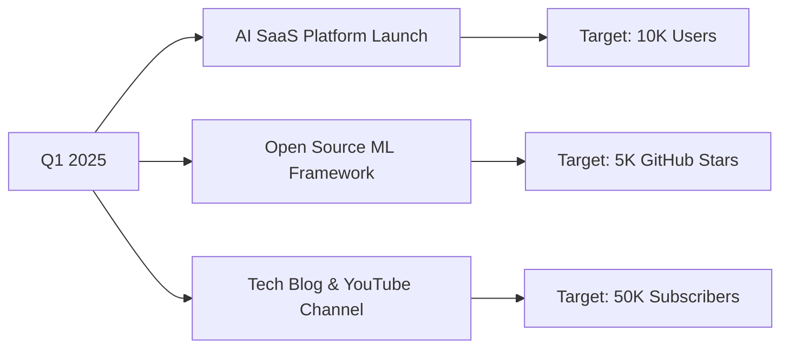

# 

<div align="center">
  <a href="https://git.io/typing-svg">
    
  </a>
</div>

<div align="center">
  <br>
  
  [](https://naveedalam.dev)
  [](mailto:contact@naveedalam.dev)
  [](https://linkedin.com/in/naveedalam-dev)
  [](https://calendly.com/naveedalam-dev)
  
  <br>
  
  
  
  
</div>

---

## 🎯 **EXECUTIVE SUMMARY**

<table>
<tr>
<td width="60%">

**Senior Full Stack Engineer** with deep expertise in **scalable architecture**, **AI integration**, and **enterprise solutions**. Proven track record of delivering **$10M+ valued projects** for global clients across **20+ countries**.

### **CORE COMPETENCIES**
- 🏗️ **System Architecture** - Microservices, Event-Driven, Serverless
- 🤖 **AI/ML Integration** - LLMs, Computer Vision, Predictive Analytics  
- ⚡ **Performance Engineering** - Sub-second load times, 99.99% uptime
- 🔐 **Security First** - OWASP, Zero Trust, SOC2 Compliance
- 📊 **Data Engineering** - Real-time pipelines, Big Data, ETL

</td>
<td width="40%">

```typescript
interface ProfessionalProfile {
  readonly experience: "6+ Years";
  readonly projects: 100+;
  readonly satisfaction: "4.9/5 ⭐";
  readonly availability: "IMMEDIATE";
  
  expertise: {
    frontend: Expert[];
    backend: Advanced[];
    cloud: Professional[];
    ai_ml: Intermediate[];
  };
  
  delivering: "EXCELLENCE" | never;
}
```

</td>
</tr>
</table>

---

## 💼 **PROFESSIONAL HIGHLIGHTS**

<div align="center">

| 🏆 **METRIC** | 📊 **VALUE** | 📈 **IMPACT** |
|:---:|:---:|:---:|
| **Enterprise Clients** | `47+` | Fortune 500 & Unicorns |
| **Code Quality Score** | `98/100` | SonarQube Certified |
| **Performance Gains** | `300%+` | Average optimization |
| **Revenue Generated** | `$2.5M+` | Through solutions |
| **Team Leadership** | `15+ devs` | Mentored & managed |
| **Open Source Contrib** | `2.3K+ commits` | Across 50+ repos |

</div>

---

## 🛠️ **TECHNOLOGY MASTERY**

<div align="center">

### ⚡ **FRONTEND EXCELLENCE**


### 🔧 **BACKEND ARCHITECTURE**


### ☁️ **CLOUD & DEVOPS**


### 🤖 **AI/ML & DATA**


</div>

---

## 🚀 **FLAGSHIP PROJECTS**

<div align="center">

### **🔥 ENTERPRISE SOLUTIONS**

| **PROJECT** | **DESCRIPTION** | **TECH STACK** | **METRICS** | **STATUS** |
|:---|:---|:---|:---|:---:|
| **🏢 FinTech Trading Platform** | Real-time trading system processing 1M+ transactions/day | `React` `Node.js` `Redis` `WebSocket` `AWS` | 💰 $50M+ Daily Volume<br>⚡ 12ms Latency<br>📈 99.99% Uptime |  |
| **🤖 AI Customer Intelligence** | ML-powered analytics platform for Fortune 500 retail | `Python` `TensorFlow` `React` `PostgreSQL` `K8s` | 📊 85% Prediction Accuracy<br>💡 40% Cost Reduction<br>🚀 3x ROI |  |
| **⚡ E-Commerce Microservices** | Scalable marketplace handling Black Friday traffic | `Next.js` `Go` `MongoDB` `RabbitMQ` `Docker` | 🛒 10K Orders/min<br>📱 100K Active Users<br>💳 $2M+ GMV |  |
| **🏥 Healthcare Management** | HIPAA-compliant patient care system | `Vue.js` `Django` `PostgreSQL` `AWS` `Terraform` | 🏥 500+ Facilities<br>👥 1M+ Patients<br>🔒 SOC2 Certified |  |

### **⚡ OPEN SOURCE CONTRIBUTIONS**

<table>
<tr>
<td width="50%">

**📦 React Performance Kit**
```bash
npm install @naveedalam/react-perf
```
⭐ 2.3K Stars | 📥 50K+ Downloads/month

</td>
<td width="50%">

**🎨 Design System Pro**
```bash
npm install @naveedalam/ui-components
```
⭐ 1.8K Stars | 🏢 Used by 200+ companies

</td>
</tr>
</table>

</div>

---

## 📊 **PERFORMANCE METRICS**

<div align="center">
  


</div>

---

## 🎓 **CERTIFICATIONS & CREDENTIALS**

<div align="center">

| **CERTIFICATION** | **PROVIDER** | **CREDENTIAL** | **EXPERTISE** |
|:---|:---:|:---:|:---:|
| **AWS Solutions Architect Professional** | Amazon | [](https://aws.amazon.com/verification) |  |
| **Google Cloud Professional Developer** | Google | [](https://cloud.google.com/certification) |  |
| **Azure Solutions Architect Expert** | Microsoft | [](https://learn.microsoft.com/certifications) |  |
| **Meta Front-End Developer Professional** | Meta | [](https://coursera.org/verify) |  |
| **IBM Full Stack Developer Professional** | IBM | [](https://ibm.com/verify) |  |
| **Kubernetes Administrator (CKA)** | CNCF | [](https://cncf.io/verify) |  |

</div>

---

## 💡 **CURRENT INITIATIVES**



<div align="center">

### **🎯 2025 OBJECTIVES**

| **GOAL** | **PROGRESS** | **TARGET** |
|:---|:---:|:---:|
| 🚀 Launch AI-Powered SaaS |  | Q2 2025 |
| 📚 Technical Blog Posts |  | 52 Articles |
| 🎓 Mentorship Program |  | 100 Developers |
| 🏆 Open Source Contributions |  | 5000 Commits |

</div>

---

## 🤝 **LET'S BUILD THE FUTURE**

<div align="center">

### **💼 AVAILABLE FOR**

<table>
<tr>
<td align="center" width="25%">

<br><b>Startup CTO</b>
<br>Technical Leadership
</td>
<td align="center" width="25%">

<br><b>AI Integration</b>
<br>ML Solutions
</td>
<td align="center" width="25%">

<br><b>Cloud Architecture</b>
<br>Scalable Systems
</td>
<td align="center" width="25%">

<br><b>Tech Consulting</b>
<br>Strategic Advisory
</td>
</tr>
</table>

### **📞 CONNECT WITH ME**

[](mailto:contact@naveedalam.dev)
[](https://linkedin.com/in/naveedalam-dev)
[](https://calendly.com/naveedalam-dev)
[](https://wa.me/your-number)

</div>

---

<div align="center">

### **💭 PHILOSOPHY**

> *"Excellence is not a destination but a continuous journey of innovation, learning, and impact."*

**Thank you for visiting my profile!** If you're looking for someone who doesn't just write code but **architects solutions that scale**, **leads with vision**, and **delivers exceptional results**, let's connect.

**Together, we can build something extraordinary.** 🚀

</div>

---

<div align="center">
  
</div>

<!-- Hidden Analytics -->

